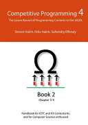
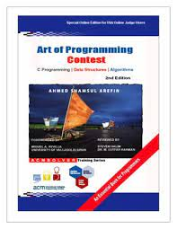

# Parand Data Structure and Algorithm Competitive Practice

<!-- [english](#Intro) -->

# مقدمه

این ریپو (Repository) برای ثبت سوال و جواب های قرار شده در تاپیک الگوریتم (DSA: Data Structures & Algorithms) گروه کانون برنامه نویسی پرند درست شده. علاوه بر این ها توضیح مختصر راجب ICPCو مسابقات الگوریتم، منابع موجود و بانک سوالات نیز تعبیه شده. سعی میشه با توجه به منابع روز و مورد نیاز استفاده کننده هاو لیست منابع و محتویات توضیحات نیز به روز بشن.

دوستانی که بار اولشونه از گیتهاب استفاده میکنن و میخوان با گیت و گیتهاب آنشایی پیدا کنن میتونن از لینک های زیر کمک بگیرن

> https://www.theodinproject.com/lessons/foundations-setting-up-git

> https://www.theodinproject.com/lessons/foundations-introduction-to-git

> https://www.theodinproject.com/lessons/foundations-git-basics

<!--
آموزش الگوریتم برنامه نویسی فقط راه حل مسائل نیستند. آنها یک مسیر کارآمد برای تکمیل وظایف، تجزیه و تحلیل مجموعه داده های پیچیده و وارد کردن داده ها ارائه می دهند. آنها هسته برنامه نویسی را تشکیل می دهند که بدون آنها احتمالاً دنیای فناوری محور وجود نخواهد داشت.

اهمیت الگوریتم در مصاحبه برخی حوزه ها -->

## فهرست

- [ توضیح عملکرد ریپو](#توضیح-ریپو-repository)

- [مسابقات](#آی-سی-پی-سی-icpc)

- [منابع](#منابع-آموزشی-و-سوالات)

# توضیح ریپو (Repository)

سوال ها به ترتیب قرارگیری در گروه و ریپو شماره گذاری می شوند.
به طور مثال `01` به معنی فایل اولیه قرار گرقته شده در گروه و ریپو است. در ادامه به بقیه دسته بندی ها میپردازیم

## سختی سوال ها

سختی سوال ها بعد از شماره ی آن در اسم ذکر شده که به ترتیب زیر است:

| پسوند | میزان سختی |
| ----- | ---------- |
| A     | آسان       |
| B     | متوسط      |
| C     | سخت        |

> `01A`

    	حرف A بعد از شماره سوال به معنی آسان بودن سوال است.

## موضوع های سوالات

سوالات الگوریتم موضوع های زیادی دارن و درکل مضوع مهم در اونها طرز فکر و طریقه پیاده سازی هست. بعلاوه که گاهی یک مسئله میتونه به چند روش مختلف حل شه. ولی به طور معمول در ۹ دسته زیر میشه اون هارو طبقه بندی کرد (با اسم الگوریتم ها به مرور زمان آشنا میشین و جای نگرانی نیست. یه سری از اونهارو شایدم استفاده میکنین و فقط اسمشونو نمیدونین):

### لیست موضوعات

#### رشته

الگوریتم های تغییر و پیمایش برروی رشته ها را شامل و رابطه ی نزدیکی با الگوریتم های جستجو دارد. موضوع طریقه پیاده سازیدر این نوع سوال ها پررنگ تر است. مثال الگوریتمها:

> Knuth Morris Pratt(KMP), Z algorithm, Suffix arrays/Suffix trees. These are bit advanced algorithms

#### گراف

این دسته از سوالات ارتباط نزدیکی با نظریه ماتریس ها و ساختمان داده دارند. به ویژه درخت ها و الگوریتم جستجو در آنها. مثال الگوریتمها:

> Breadth first search(BFS), Depth first search(DFS), Strongly connected components(SCC), Dijkstra, Floyd-Warshall, Minimum spanning tree(MST), Topological sort.

#### برنامه نویسی پویا

برنامه نویسی پویا (Dynamic Programming) در کل درنظر دارد تا از محاسبه اضافی جلوگیری کند. اغلب سوالات برنامه نویسی پویا با تکرار و با استفاده از روابط بازگشتی (recursion) قابل حل هستند، ولی اینگونه حل بهینه نبوده و با پیاده سازی های خاص روش های بهینه برای اینکار وجود دارد. مثال الگوریتمها:

> Standard dynamic programming problems such as Rod Cutting, Knapsack, Matrix chain multiplication etc.

##### نظریه اعداد

مجموعه روش های رسیدن به اعداد مورد نظر با توجه تئوری های این حوزه. به جای استفاده از متد brute-force (در نظر گرفتن تمام حالت ها و ادامه تا رسیدن به جواب) و امتحان تمام حالت های مساعد با شرط سوال، از شرط سوال عدد های مد نظر را تولید میکنیم. این مجموعه روش ها ارتباط نزدیکی با برنامه نویسی پویا دارند. مثال الگوریتمها:

> Modular arithmetic, Fermat’s theorem, Chinese remainder theorem(CRT), Euclidian method for GCD, Logarithmic Exponentiation, Sieve of Eratosthenes, Euler’s totient function.

#### حریصانه

الگوریتم های حریصانه (Greedy algorithms) با توجه به اختصاص معیار (heuristic value) در هرمرحله سعی میکند بهترین گزینه برای الگوریتم را انتخاب کند. مثال الگوریتمها:

> Standard problems such as Activity selection.Standard problems such as Activity selection.

#### جستجو

مجموعه الگوریتم های مربوط به جستجو در یک دنباله. مثال الگوریتمها:

> Binary search, Ternary search and Meet in the middle.

#### ساختمان داده

ساختمان های داده پایه حل مسائل الگوریتم هستند و انتخاب نوع داده درست در حل سوال آنچنان موثر هست که معمولا اینگونه سوال ها در دسته بندی مختص ساختمان داده قرار میگیرد. مثال از داده ساختار ها:

> Data structures (Basic): Stacks, Queues, Trees and Heaps.
> Data structures (Advanced): Trie, Segment trees, Fenwick tree or Binary indexed tree(BIT), Disjoint data structures.

##### هندسه

بخشی از سوالات الگوریتم مربوط به مسائل ریاضی و به ویژه هندسه هست. ولی به طور معمول دانش زیادی از ریاضی و هندسه مورد نیاز نیست و از قواعد ساده آن استفاده میشد. مثال:

> Graham-Scan for convex hull, Line sweep.

#### نظریه بازی ها

مجموعه سوالات الگوریتم که با توجه به قواعد و شرط های زیاد برای اجرا در این دسته قرار میگیرند. سوالات مربوط به بازی هایی مثل شطرنج با شرایط خاص در این دسته هستند. مثال ها:

> Basic principles of Nim game, Grundy numbers, Sprague-Grundy theorem.

### نماد ها

| موضوع               | پسوند |
| ------------------- | ----- |
| Graph               | G     |
| string              | S     |
| Search              | R     |
| Number Theory       | N     |
| Dynamic Programming | D     |
| Greedy              | G     |
| Data Structure      | T     |
| Geometry            | M     |
| Game Theory         | A     |

> `01A-M`

    	سوال هندسه ساده

> `04B-GT`

    	سوال ساختمان داده و گراف متوسط

# آی سی پی سی (ICPC)

مسابقات بین‌المللی برنامه‌نویسی دانش‌جویی (ICPC) همه ساله به عنوان یکی از مهم‌ترین و معتبرترین مسابقات برنامه‌نویسی در سطج جهان برگزار می‌گردد. این مسابقات تا سال ۲۰۱۸ از سوی انجمن ماشین‌های محاسباتی و با پشتیبانی شرکت‌های بزرگی چون IBM برگزار می‌شد و با نام ACM-ICPC خوانده می‌شد. این مسابقات در ایران به اختصار به مسابقات ای‌سی‌ام معروف است. تیم‌های شرکت‌کننده در این مسابقات، دانشجویان دانشگاه‌های سرتاسر جهان هستند که ابتدا در مسابقات منطقه‌ای شرکت می‌کنند و سپس تیم‌های برگزیده جواز حضور در فینال را کسب می‌نمایند. مسابقه فینال معمولاً در اوایل بهار هر سال برگزار می‌شود. مسابقات منطقه‌ای غرب آسیا از سال ۱۳۷۸ تا کنون (به جز سال ۱۳۹۰) در دانشگاه صنعتی شریف برگزار شده‌است. مسابقه منطقه‌ای غرب آسیا عموماً در اواخر پاییز هر سال برگزار می‌شود.

> ویدئو یوتیوب کامل برگزاری مسابقات فینال ICPC 2022 Dhaka [اینجا](https://www.youtube.com/watch?v=15Wyj_-PG9I)

در چنین مسابقاتی علاوه بر تسلط بر یکی از زبان‌های برنامه‌نویسی C,CPP, JAVA, KOTLIN, PYTHON(البته تضمین می‌شود تمام سؤال‌ها به وسیله C/CPP/JAVA قابل حل باشند) مباحثی نظیر طراحی الگوریتم و ساختمان داده‌ها بسیار تأثیرگذار هستند.

مسابقات بین‌المللی برنامه‌نویسی دانش‌جویی یک مسابقهٔ تیمی می‌باشد. قوانین موجود بیان می‌کنند که هر تیم باید شامل ۳ نفر باشد. شرکت‌کنندگان باید در دانشگاه مشغول به تحصیل باشند و کمتر از ۴ سال سابقهٔ حضور در دانشگاه داشته باشند. دانشجویانی که دو بار در مرحلهٔ جهانی حضور داشته‌اند نیز نمی‌توانند در مسابقه شرکت کنند. مدت مسابقه مغمولا ۵ ساعت (بسته به سختی و تعداد سوال میتواند تغییر کند) و تعداد سؤالاتی معمولاً بین ۸ تا ۱۲ سؤال است. تیم‌ها که تنها یک رایانه در اختیار دارند، باید جواب‌های خود را در قالب کد به سیستم داوری خودکار ارسال کنند. سپس برنامه‌های ارسالی توسط داده‌ها مورد آزمایش قرار می‌گیرند. اگر برنامه‌ای نتواند در مقابل تمام داده‌ها پاسخ درستی بدهد مورد قبول قرار نمی‌گیرد و تیم با احتساب جریمه می‌تواند برنامه دیگری ارسال کند.

> ‌ برندگان گذشته مسابقات و اطلاعات رقابت آن سال [اینجا](https://icpc.global/community/world-finals-champions)

تیمی برنده است که بیشترین تعداد سؤال‌ها را به درستی حل کند. اگر رتبه‌بندی تیم‌ها برای دریافت مدال و جوایز ضروری باشد، رتبه تیم با توجه به زمان سپری شده در هر مرحله برای ارسال پاسخ درست به علاوهٔ بیست دقیقه برای هر پاسخ نادرست که قبل از هر سؤال حل شده ارسال شده، تعریف می‌شود.

به عنوان مثال شرایطی را برای دو تیم آبی و قرمز در نظر می‌گیریم. این دو تیم از نظر تعداد سؤالات حل شده با یک دیگر برابر هستند. تیم قرمز پاسخ‌های خود را برای سؤالات A و B به ترتیب در ۰۱:۰۰ و ۰۲:۴۵ پس از آغاز مسابقه ارسال کرده‌است. همچنین تیم قرمز یک پاسخ غلط برای سؤال C ارسال کرده‌است اما چون نتوانستند سؤال C را حل کنند این پاسخ غلط در نظر گرفته نمی‌شود. تیم آبی پاسخ‌های خود را برای سؤالات A و C در ۰۱:۲۰ و ۰۲:۰۰ پس از آغاز مسابقه ارسال کرده‌است. همچنین تیم آبی یک ارسال غلط برای سؤال C داشته‌است.نتیجه به این صورت ارزیابی می‌شود که تیم قرمز در مجموع ۰۱:۰۰+۰۲:۴۵=۳:۴۵ و تیم آبی در مجموع ۰۱:۲۰+۰۲:۰۰+۰۰:۲۰=۰۳:۴۰ زمان برای سؤالات صرف کرده‌اند. در نتیجه تیم آبی برنده است. (برگرفته از ویکیپدیا و ICPC.global)

مسابقه‌ی منطقه‌ای تهران هر سال با شرکت ۸۰ تیم از دانشگاه‌های سراسر کشور برگزار می‌گردد. هرساله این مسابقات در پاییز در دانشگاه شریف برگزار می‌شود.برای شرکت تاریخ آن را با [سایت](https://ssc.ce.sharif.edu/pages/forms/%D8%AB%D8%A8%D8%AA-%D9%86%D8%A7%D9%85-%D8%AF%D8%B1-%D9%85%D8%B3%D8%A7%D8%A8%D9%82%D9%87-%D8%A7%D9%86%D8%AA%D8%AE%D8%A7%D8%A8%DB%8C-acm-icpc-%D8%AF%D8%A7%D9%86%D8%B4%DA%AF%D8%A7%D9%87-%D8%B5%D9%86%D8%B9%D8%AA%DB%8C-%D8%B4%D8%B1%DB%8C%D9%81/) مربوطه چک کنید. پس از پایان مهلت ثبت‌نام، نحوه‌ی انتخاب تیم‌ها از طریق ایمیل به شما اطلاع رسانی می‌شود.

> قوانین مسابقات ICPC منطقه ای [اینجا](https://icpc.global/regionals/rules)

> قوانین مسابقات ICPC فینال [اینجا](https://icpc.global/worldfinals/rules)

# منابع آموزشی و سوالات

برای دانلود کتاب آموزشی میتونین از سایت libgenesis استفاده کنین.

<a href="https://www.libgen.is/">
Library Genesis
</a>

منابع آموزشی انگلیسی مربوط، خیلی زیاد هستن. از منابع معروف که برای شروع مناسب هستن به صورت زیر طبقه بندی شدن.

## سایت های رقابت و بانک سوالات

تعداد سایت های برگزار کننده مسابقات آنلاین بسیار زیاد است ولی سایت های معروف و آن هایی که مناسب دیده شده را اینجا ذکر کردیم:

- [Codeforces](https://codeforces.com/)

  > سایت معروف و قدیمی مربوط به مسابقات الگوریتم که کامیونیتی بسیاز بزرگی دارد
  >
  > تعداد زیادی سوال در موضوعات مختلف در بایگانی دارد و مسابقات آن به صورت مداوم تشکیل میشود
  >
  > توصیه میشود حتما ثبت نام کرده و به آن برای حل سوال سر بزنید.

- [Codechef](https://www.codechef.com/)

  > از سایت های محبوب حل سوال الگوریتم که بانک سوال قابل توجهی دارد و مسابقه آن به صورت مداوم و هفتگی چهارشنبه ها برگزار میشود.
  >
  > توصیه میشود مسابقات آن هفتگی شرکت شود و برای رقابت بیشتر میتوانید نام دانشگاه خود را نیز وارد کرده تا وضعیت حل سوال هم دانشگاهیی های خود را نیز ببینید.

- [Quera (کوئرا فارسی)](https://quera.org/)

  > سایت کوئرا کار خودش رو در تابستان ۹۴ با یک تیم سه‌نفره از دانشجوهای شریف شروع کرد. که بعد ها به سایت جامعه ای برای برنامه نویسان تبدیل شد.
  >
  > این سایت علاوه بر بانک سوالات و مسابقات داخلی، دوره های آموزشی داشته و با تکمیل پروفایل میتونین برای شرکت ها رزومه بفرستین. وضعیت حل سوالات الگوریتم و رتبه مسابقات هم میتونه در قسمت رزومه از طرف کوئرا قرار بگیره.

- [Topcoder](https://www.topcoder.com/)
  > از سایت های قدیمی بوده که دوره های آموزشی مناسبی داشته و بانک سوالات نسبتا خوبی داره
  >
  > این سایت برای دسترسی کاربران ایرانی گاهی میتونه مشک باشه

## سایت های آموزشی

- [Geeks for Geeks](https://www.geeksforgeeks.org/)

> سایت هندی بسایر معروف بین برنامه نویسان.
> سه بخش جالب توجه برای مسابقات الگوریتم لینک های زیر هستن:
>
> - [How to prepare for ACM – ICPC?](https://www.geeksforgeeks.org/how-to-prepare-for-acm-icpc/)
> - [Competitive Programming – A Complete Guide](https://www.geeksforgeeks.org/competitive-programming-a-complete-guide/)
> - [Complete Roadmap To Learn DSA From Scratch](https://www.geeksforgeeks.org/complete-roadmap-to-learn-dsa-from-scratch/)

- [CodeChef](https://www.codechef.com/)
  > کدشف سایت هندی آموزشی ،بانک سوال و برگزار کتتده مسابقات هفتگی دردسته های مختلف است. که از دارود (Judge) SPOJ استفاده میکند.
  >
  > سایت بسیار مفیدی است و توصیه به شرکت در رقابت های آن میشود.
  > آموزش های رقابتی آن به زبان های برنامه نویسی مختلف وجود دارد
- [TopCoder](https://www.topcoder.com/)

  > از سایت های قدیمی برگزاری رقابت هال الگوریتمی و دوره های مربوط به آن برای مسابقات و مصاحبه های کاری است

- Other Sources
  > - https://github.com/jwasham/coding-interview-university
  > - https://cp-algorithms.com
  > - https://silly-servant-943.notion.site/Data-Structures-and-Algos-da138a46aab3466f9f0b196f16375bc0
  > - https://roadmap.sh/computer-science

## کتب آموزشی

برای دانلود کتاب مورد نظر میتونین از سایت [libgensis](https://www.libgen.is/) استفاده کنین

کتاب های متنوعی در این زمینه وجود دارد ولی ۴ کتاب معروف که پرطرفدار هستند به صورت زیر است:

### 1 Programming Challenges

کتاب مناسبی برای شروع. همراه با تمرین ها

### 2 Introduction to Algorithms(CLRS)

بهترین کتاب برای یادگیری الگوریتم ولی متن آسانی برای شروع ندارد. معمولا توصیه میشود قبل از شروع این کتاب کتاب های دیگر در این زمینه ها مطالعه کرده باشید.

### 3 Algorithms unlocked

.

همراه با توضیح ساده و مناسب برای شروع.

### 4 Competitive Programming

این کتاب مختص مسابقات بوده و به سبک ICPC نزدیک تر است.

### نکته

> توصیه میشود برای شروع از کتاب های ۱ و ۳ (Algorithms unlocked و Programming Challenges) شروع کرده و بعدا سراغ کتاب ۲ و ۴ (Introduction to Algorithms و Competitive Programming)رفته.

### 5 Art of Programming Contest

این کتاب توسط یکی از شرکت کننده های ICPC نوشته شده و مطالعه اون مخصوصا برای دوستانی که C/CPP کار میکنن توصیه میشه.

## لینک های کمکی

### پیگیری اخبار ICPC

http://blog.icpc.ir/

    البته فعالیت سایت نسبت به گذشته خیلی ضعیف شده

### سایت دانلود کتاب Library Genesis

https://www.libgen.is/

### دانلود دوره های آموزشی از تورنت ها

https://www.pirateproxy-bay.com/

https://torrentgalaxy.mx/

<!-- # Intro -->
